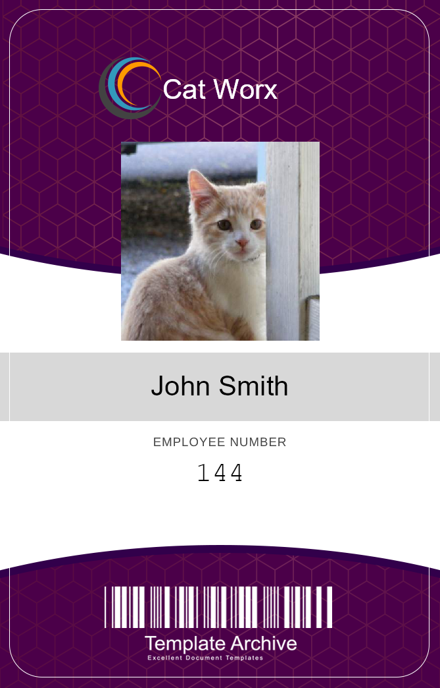

# Employee Badge Generator CLI

## Description

This command line application allows users to generate a security badge using information given by a user regarding an employee's name, id, and a url linked to their photo.

## Table of Contents

* [Usage](#usage)

* [License](#license)

* [Credits](#credits)

* [Questions](#questions)

## Usage

This application is built using C# and is run in the terminal, thus the user will run the command 'dotnet run' and will be prompted whether they want to manually input their employee's names, or test the application by generating 10 random employees. The application will then use the information given by the user or the generator API to draw a badge using SkiaSharp bitmaps with their name, id, photo, and company name. The user can input as many employees as they need and the badges will be saved in the data folder.

## License

This project is licensed under the MIT license.

## Credits

SkiaSharp

Random User Generator API

Newtonsoft.Json

## Questions

If you have any questions about this repository, open an issue or contact me at jthnguyen9909.work@gmail.com. You can find more of my work at [jthnguyen9909](https://github.com/jthnguyen9909).

